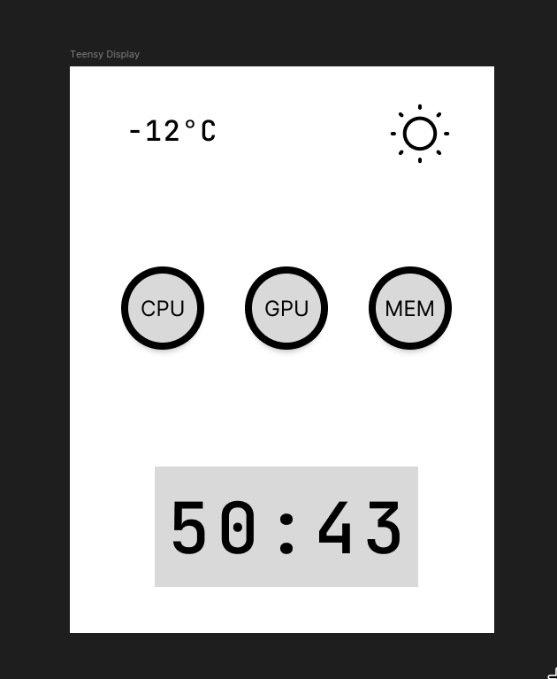

# Steps

- Create accurate representation of display in Figma
- Features:
  - weather -> icon, temp, wind
  - specs -> cpu, gpu, mem, temp, percentage
  - timer -> work and rest
- add a button for navigating pages or timer

## Information

### Display

LCD Display, 2.4 inch 240x320 SPI TFT LCD Display Panel Module ILI9341 Driver with PCB 5V/3.3V STM32 for Teensy 3.2
[amazon link](https://www.amazon.ca/gp/product/B086MBZD3Z?ie=UTF8&psc=1)

### Current design

